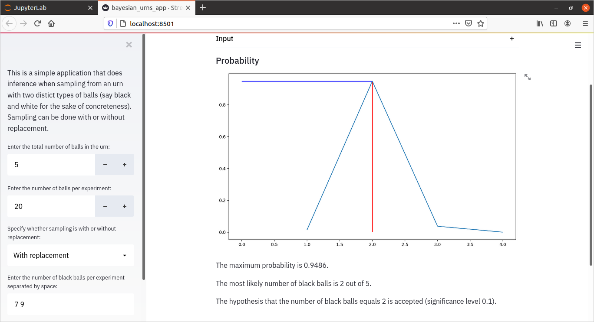

# bayesian_urns

This is a small application that does inference when sampling from an urn with two distict types of balls (say black and white for the sake of concreteness). 
Sampling can be done with or without replacement.

To run it, type in the terminal

$ streamlit run bayesian_urns_app.py

